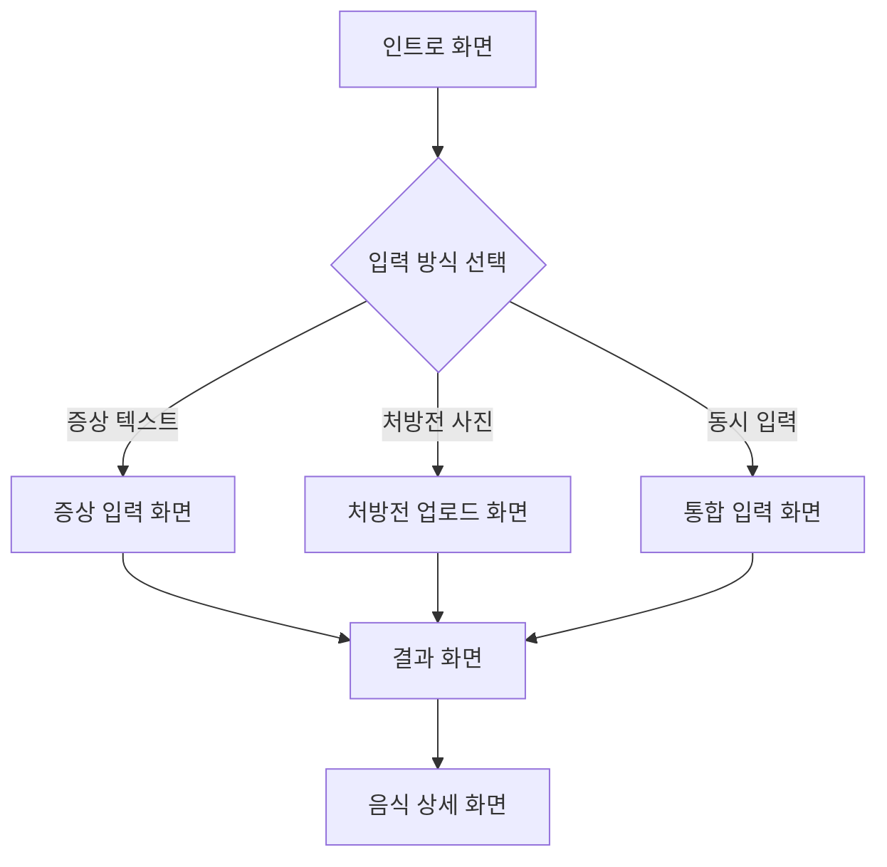

# Health Stack MVP 화면 기획서

## 📋 문서 정보
- **작성일**: 2026-02-07
- **버전**: v1.0
- **범위**: MVP 핵심 기능 6가지에 대응하는 화면 구성

---

## 🎯 MVP 사용자 플로우



---

## 📱 화면 구성 (총 5개)

### Screen 1. 인트로 화면
> 서비스 소개 + 입력 방식 선택

| 영역 | 내용 |
|------|------|
| **헤더** | Health Stack 로고 |
| **메인 카피** | "지금 내 몸 상태에서<br>어떤 음식이 도움이 될까?" |
| **서브 카피** | "증상이나 처방전을 알려주세요" |
| **CTA 버튼 3개** | ① 증상으로 시작하기<br>② 처방전 사진 올리기<br>③ 둘 다 입력하기 |
| **면책 문구** | "본 서비스는 의료 진단이 아닌 생활 가이드입니다" |

**디자인 노트**
- 따뜻한 톤 (오렌지/베이지 계열)
- 버튼은 충분히 크게 (터치 영역 48px 이상)
- 깨끗하고 신뢰감 있는 느낌

---

### Screen 2. 증상 입력 화면
> MVP 기능 ①: 증상 텍스트 입력

| 영역 | 내용 |
|------|------|
| **네비게이션** | ← 뒤로가기 |
| **제목** | "어떤 증상이 있으신가요?" |
| **텍스트 입력** | 멀티라인 텍스트 영역<br>placeholder: "예: 속이 더부룩하고 소화가 안 돼요" |
| **빠른 선택 태그** | 소화불량 / 수면장애 / 피로 / 냉증 / 두통 |
| **제출 버튼** | "분석하기" (Primary) |

**인터랙션**
- 태그 클릭 시 텍스트 영역에 자동 추가
- 최소 5자 이상 입력 시 버튼 활성화

---

### Screen 3. 처방전 업로드 화면
> MVP 기능 ①②: 처방전 사진 → OCR 추출

| 영역 | 내용 |
|------|------|
| **네비게이션** | ← 뒤로가기 |
| **제목** | "처방전 또는 약봉투를 찍어주세요" |
| **업로드 영역** | 📷 카메라 / 🖼️ 갤러리 선택<br>드래그앤드롭 지원 (웹) |
| **가이드 이미지** | 올바른 촬영 예시 (밝고, 글씨 선명하게) |
| **미리보기** | 업로드된 이미지 썸네일 + 삭제 버튼 |
| **제출 버튼** | "분석하기" (Primary) |

**OCR 처리 중 상태**
- 로딩 스피너 + "처방전을 읽고 있어요..."
- 예상 소요 시간: 3~5초

---

### Screen 4. 통합 입력 화면
> MVP 기능 ①②: 증상 + 처방전 동시 입력

| 영역 | 내용 |
|------|------|
| **네비게이션** | ← 뒤로가기 |
| **섹션 A: 증상** | Screen 2와 동일 (텍스트 + 태그) |
| **구분선** | "+" 아이콘 |
| **섹션 B: 처방전** | Screen 3과 동일 (업로드 영역) |
| **제출 버튼** | "함께 분석하기" (Primary) |

**유효성**
- 증상 또는 처방전 중 하나 이상 입력 시 버튼 활성화

---

### Screen 5. 결과 화면 ⭐ (핵심)
> MVP 기능 ③④⑤⑥: 상태 요약 + 음식 추천 + 근거 + 실행

#### 5.1 상단: 몸 상태 요약 (MVP ③)

| 영역 | 내용 |
|------|------|
| **카드 헤더** | 🩺 현재 상태 이해 |
| **요약 텍스트** | "입력 정보를 종합하면,<br>**위장 기능 저하 + 소화력 약화** 상태로 보입니다." |
| **톤** | 단정 ❌ → "~로 보입니다", "~일 수 있어요" |
| **면책** | 작은 글씨로 "의학적 진단이 아닌 생활 관점 해석입니다" |

---

#### 5.2 중단: 동의보감 음식 추천 (MVP ④)

| 영역 | 내용 |
|------|------|
| **섹션 헤더** | 🍃 동의보감이 말하는 음식 |
| **카드 x 3개** | 음식별 카드 (고정 3개) |

**음식 카드 구성**
```
┌─────────────────────────────────┐
│ 🥕 [음식 이미지]                 │
├─────────────────────────────────┤
│ 무 (생채)                       │
│ ─────────────────               │
│ "기를 내리고 소화를 돕는다"       │
│ (동의보감 탕액편)                │
├─────────────────────────────────┤
│ ⚠️ 주의: 냉증이 심하면 과다섭취 주의 │
├─────────────────────────────────┤
│ [📚 근거 보기] [▶️ 영상 보기]    │
└─────────────────────────────────┘
```

---

#### 5.3 하단: 근거 연결 (MVP ⑤)

| 영역 | 내용 |
|------|------|
| **펼침 영역** | "📚 근거 보기" 클릭 시 확장 |
| **논문 카드** | PubMed 논문 1~2개 |

**논문 카드 구성**
```
┌─────────────────────────────────┐
│ 📄 Radish intake and digestive  │
│    function improvement (2019)  │
│ ─────────────────               │
│ "무 추출물이 위장 운동을          │
│  촉진한다는 연구 결과"            │
│                                 │
│ [PubMed에서 보기 →]             │
└─────────────────────────────────┘
```

---

#### 5.4 하단: 실행 연결 (MVP ⑥)

| 영역 | 내용 |
|------|------|
| **펼침 영역** | "▶️ 영상 보기" 클릭 시 확장 |
| **유튜브 썸네일** | 관련 영상 1개 |
| **한 줄 팁** | "무생채로 간단하게 챙겨보세요" |

**영상 카드 구성**
```
┌─────────────────────────────────┐
│ ▶️ [유튜브 썸네일]               │
│    "5분 무생채 만들기"           │
│ ─────────────────               │
│ 💡 이렇게 먹으면 좋아요:          │
│ "식후 반찬으로 조금씩 드세요"     │
└─────────────────────────────────┘
```

---

## 🎨 디자인 시스템 권장

### 컬러 팔레트
| 용도 | 컬러 | HEX |
|------|------|-----|
| Primary | 살구색 | #F4A261 |
| Secondary | 올리브 그린 | #2A9D8F |
| Background | 아이보리 | #FDF6EC |
| Text | 차콜 | #264653 |
| Warning | 테라코타 | #E76F51 |

### 타이포그래피
| 용도 | 폰트 | 크기 |
|------|------|------|
| 헤드라인 | Pretendard Bold | 24px |
| 본문 | Pretendard Regular | 16px |
| 캡션 | Pretendard Light | 12px |

---

## 📐 와이어프레임 요약

```
┌─────────────────────────────────────────────────────────┐
│  Screen 1: 인트로                                        │
│  ┌─────────────────────────────────────────────────────┐│
│  │                    🌿 Health Stack                  ││
│  │                                                     ││
│  │        "지금 내 몸 상태에서                          ││
│  │         어떤 음식이 도움이 될까?"                    ││
│  │                                                     ││
│  │  ┌─────────────────────────────────────────────┐   ││
│  │  │         증상으로 시작하기                     │   ││
│  │  └─────────────────────────────────────────────┘   ││
│  │  ┌─────────────────────────────────────────────┐   ││
│  │  │         처방전 사진 올리기                    │   ││
│  │  └─────────────────────────────────────────────┘   ││
│  │  ┌─────────────────────────────────────────────┐   ││
│  │  │         둘 다 입력하기                       │   ││
│  │  └─────────────────────────────────────────────┘   ││
│  │                                                     ││
│  │  ⚠️ 본 서비스는 의료 진단이 아닌 생활 가이드입니다   ││
│  └─────────────────────────────────────────────────────┘│
└─────────────────────────────────────────────────────────┘
```

---

## ✅ MVP 기능 ↔ 화면 매핑

| MVP 기능 | 화면 |
|----------|------|
| ① 입력 방식 3가지 | Screen 1, 2, 3, 4 |
| ② 처방전 OCR 추출 | Screen 3, 4 (로딩 상태) |
| ③ 몸 상태 요약 | Screen 5 - 섹션 5.1 |
| ④ 동의보감 음식 추천 | Screen 5 - 섹션 5.2 |
| ⑤ 근거 연결 (PubMed) | Screen 5 - 섹션 5.3 |
| ⑥ 실행 연결 (YouTube) | Screen 5 - 섹션 5.4 |

---

## 🚀 다음 단계

1. **UI 목업 생성** - Figma 또는 이미지 생성
2. **컴포넌트 구현** - React/Next.js 기반
3. **API 연동** - OCR, PubMed, YouTube API
