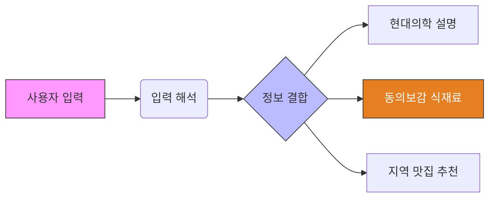

<!-- _class: lead -->
# Health Stack 통합 기획안
## 증상·처방전 기반 개인 맞춤 건강 이해 & 생활 추천 서비스
### (Golden Questions 적용 시나리오 포함)

---

## 1. 서비스 정의

> **Health Stack**은 사용자가 입력한 증상과 처방전을 바탕으로,
> 약·건강정보·동의보감·음식·지역 식당·판매처를 하나의 맥락으로 연결해
> **"내 몸에 지금 필요한 선택지"**를 설명해주는 서비스

- 치료 ❌
- 처방 변경 ❌
- 과장 ❌
- **이해 + 판단 보조 + 생활 선택 가이드 ⭕**

---

## 2. 사용자 입력 방식 & 처리 흐름

Health Stack은 **입력 방식이 달라도 동일한 결과 구조**로 수렴합니다.

---

## 3. 핵심 차별점: 동의보감 + 현대의학

### 역할 정의
- 치료나 약 대체가 아님 ❌
- **생활 속에서 선택 가능한 음식 방향 제시 ⭕**

### 제공 내용
1. **증상 맞춤 식재료**: "왜 좋은가?" (동의보감 근거)
2. **주의사항**: "피해야 할 것" (현대의학/상호작용)
3. **실천**: 주변 맛집(지도), 요리법(영상), 구매처

---

## 4. 실전 시나리오 (Golden Questions)

**Golden Questions**는 실제 사용자가 물어볼 법한 핵심 질문 셋입니다.
이를 통해 Health Stack이 어떻게 답변하는지 예시를 보여드립니다.

---

### Case 1: 소화불량 (Golden Question **A1**)

> **Q. "식후 더부룩하고 트림이 잦아. 바로 먹으면 좋은 음식과 피해야 할 음식은?"**

**[Health Stack의 답변 구성]**
1.  **상태 이해**: "소화기가 약해져 가스가 차는 상태(Dyspepsia)입니다."
2.  **추천 식재료 (Recommend)**: 
    - **무 (생채)**: 소화를 촉진하고 기를 내림 (동의보감)
    - **매실 (차)**: 위장 운동을 돕고 식욕 조절
3.  **피해야 할 음식 (Avoid)**: 
    - **유제품/콩류**: 가스 유발 가능성 있음
4.  **Action**: "근처 **'전주 콩나물국밥'** (무생채 제공) 식당 추천"

---

### Case 2: 수면 장애 & 식단 (Golden Question **B1**)

> **Q. "잠이 얕고 새벽에 자주 깨. 저녁 식단으로 뭐가 좋아?"**

**[Health Stack의 답변 구성]**
1.  **상태 이해**: "수면 유지 장애(Maintenance Insomnia) 경향이 있습니다."
2.  **추천 메뉴 (Dinner Slot)**:
    - **상추 겉절이**: 락투신 성분이 숙면 유도
    - **연자죽**: 심신 안정 효과 (동의보감: 심장의 화를 내림)
3.  **Pro Tip**: "저녁에는 단백질 위주로, 매운 음식(캡사이신)은 피하세요."
4.  **Action**: **대추차** 레시피 영상("잠이 솔솔 오는 전통차") 제공

---

### Case 3: 만성질환 & 영양소 (Golden Question **D1**)

> **Q. "혈압이 경계선이야. 짠맛 줄이기 말고 '칼륨' 중심 식단 알려줘."**

**[Health Stack의 답변 구성]**
1.  **상태 이해**: "나트륨 배출을 돕는 칼륨(K) 섭취가 필요한 단계입니다."
2.  **스마트 필터링**:
    - **현미밥**: 식이섬유 + 미네랄 풍부
    - **시금치/브로콜리**: 칼륨 급원 식품
3.  **주의사항**: "신장 기능에 이상이 있다면 칼륨 과다 섭취 주의"
4.  **Action**: **iHerb** 유기농 현미/잡곡 구매 링크 연결

---

## 5. 결과 화면 구조 (User Journey)

사용자의 화면 경험은 다음과 같이 구성됩니다.

1.  **지금 상태 요약** (내가 겪는 문제 정의)
2.  **약 / 증상 이해 설명** (쉽게 풀어씀)
3.  **주의사항** (안전 확보 - 약물 상호작용 등)
4.  **동의보감 식재료 추천** (핵심 가치)
5.  **활용 방법** (영상 콘텐츠)
6.  **주변 음식점 추천** (당장 갈 곳 - 지도 API)
7.  **재료 구매 링크** (집에서 해먹을 것)

👉 **"정보 → 선택 → 행동"**이 한 화면에서 연결됨

---

## 6. 결론: Health Stack의 가치

| 구분 | 기존 서비스 | **Health Stack** |
| :--- | :--- | :--- |
| **정보 방식** | 단순 나열 | **맥락 기반 설명 (Story)** |
| **범위** | 약 / 음식 분리 | **하나의 스택으로 통합** |
| **수익** | 광고 중심 | **근거·출처 중심** |
| **성격** | 단기 조회 | **누적 관리 (My Data)** |

### "Health Stack은 **지금 내 몸 상태에서 어떤 선택지가 있는지** 가장 친절하게 알려주는 서비스입니다."
