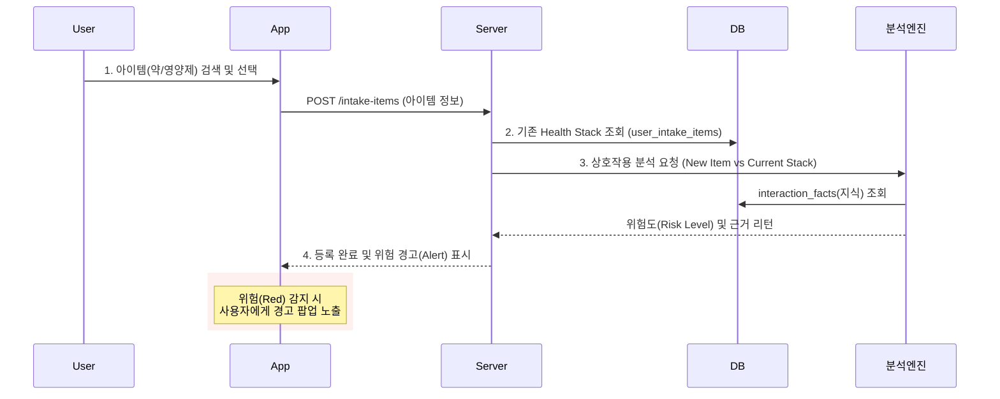

# 밥이약이다 (Babiyagida) 서비스 워크플로우

> 본 문서는 `docs/SERVICE_PLAN.md`의 서비스 기획 의도를 기술적으로 구현하기 위한 사용자 흐름(User Flow)과 데이터 처리 과정(Data Pipeline)을 정의합니다.

## 1. 서비스 정의 및 목표
**"내 몸에 들어가는 모든 것의 설명서"**
사용자가 복용 중인 약, 영양제, 음식을 통합 관리하고, 상호작용 위험을 분석하며, 개인 생활 패턴에 맞춘 섭취 스케줄을 제공합니다.

---

## 2. 사용자 시나리오 (Core User Scenarios)

### 2.1 시나리오 A: 내 몸 사용 설명서 만들기 (Onboarding & Stack)
사용자는 가장 먼저 자신의 생활 패턴을 입력하고, 현재 먹고 있는 모든 것을 등록하여 자신만의 **Health Stack**을 구축합니다.

1.  **로그인**: 카카오/구글 소셜 로그인을 통해 간편하게 접속합니다.
2.  **기준 시간(Anchor) 설정**:
    *   나의 기상, 식사(아침/점심/저녁), 취침 시간을 설정합니다.
    *   *Purpose*: "식후 30분"과 같은 상대적 복용 시간을 절대 시간으로 계산하기 위함입니다.
3.  **복용 항목 등록 (Stacking)**:
    *   약(Drug), 영양제(Supplement), 음식(Food)을 검색하여 추가합니다.
    *   *System Action*: 항목이 추가될 때마다 기존 항목들과의 **상호작용 분석**을 실시간으로 수행합니다.
4.  **위험도 확인**:
    *   🟢 안전: 문제 없음.
    *   🟡 주의: 시간 간격을 둬야 함 (예: 철분제 + 커피).
    *   🔴 위험: 병용 금기 또는 심각한 부작용 우려.

### 2.2 시나리오 B: 잊지 않고 챙기기 (Daily Routine)
등록된 Health Stack은 사용자의 생활 패턴과 결합되어 자동으로 **오늘의 할 일(To-Do)**로 변환됩니다.

1.  **스케줄 자동 생성**:
    *   (예) [비타민C: 아침 식후] + [사용자 아침: 08:00] = **08:30 알림 예약**.
2.  **푸시 알림**: 약속된 시간에 "약 먹을 시간이에요" 알림을 받습니다.
3.  **복용 체크 (Logging)**: 알림을 누르거나 앱에서 '먹었어요'를 체크하여 기록을 남깁니다.

### 2.3 시나리오 C: 아플 때 무엇을 먹을까? (Symptom Solution)
갑작스러운 증상이 생겼을 때, 내 약물 정보와 의학적 근거를 바탕으로 안전한 식단을 추천받습니다.

1.  **증상 입력**: "요즘 소화가 안 되고 속이 더부룩해."
2.  **AI 정밀 분석**:
    *   사용자의 **Health Stack(복용 약물)**을 조회하여 금기 음식을 제외합니다.
    *   입력된 증상에 도움이 되는 성분과 음식을 RAG(검색 증강 생성)로 탐색합니다.
3.  **맞춤 솔루션 제공**: "현재 위장약을 드시고 계시므로 산도가 높은 과일 대신 무를 넣은 죽을 추천해요."

---

## 3. 시스템 워크플로우 (Technical Workflow)

### 3.1 아이템 등록 및 위험 분석 흐름



### 3.2 증상 기반 식단 추천 RAG 프로세스

```mermaid
graph TD
    Start[사용자 증상 입력] --> Embed[텍스트 임베딩 생성]
    
    subgraph "Context Retrieval"
        Embed --> SearchVec[(Vector DB 검색)]
        SearchVec --> Findings[유사 증상/음식 데이터]
        
        DB[(RDB)] --> MyMeds[내 복용 약물(Stack)]
    end
    
    Findings & MyMeds --> Prompt[LLM 프롬프트 조립]
    
    Prompt --> LLM[AI 추론 엔진]
    LLM --> Result[개인화 식단 추천]
    Result --> App[화면 표시]
```

### 3.3 복용 알림 스케줄링 로직

```mermaid
flowchart LR
    Profile[사용자 생활 시간<br/>(User Profile)] --> Calc
    Rule[약물 복용 용법<br/>(Item Rules)] --> Calc
    
    Calc{스케줄 계산기} -->|Time Offset 적용| Timeline[오늘의 절대 시간표]
    
    Timeline --> DB[(INTAKE_SCHEDULES)]
    Timeline --> Push[푸시 알림 서버]
```

---

## 4. 데이터 엔티티 매핑 (ERD Reference)

이 워크플로우는 `docs/erd` 폴더의 다음 테이블들과 연동됩니다.

| 프로세스 | 핵심 테이블 | 역할 |
| :--- | :--- | :--- |
| **계정/설정** | `user_profiles` | 알림 기준 시간(Time Anchor) 관리 |
| **복용 관리** | `user_intake_items` | 사용자의 개인화된 Health Stack 저장 |
| **정보 제공** | `catalog_drugs`<br/>`catalog_supplements` | 표준화된 약/영양제 데이터베이스 |
| **스케줄링** | `intake_schedules`<br/>`intake_logs` | 계산된 알림 시간 및 실제 복용 이력 |
| **지식 검색** | `interaction_facts`<br/>`symptoms` | 상호작용 규칙 및 증상 벡터 데이터 |

---
*Created per Service Plan v1.0*
