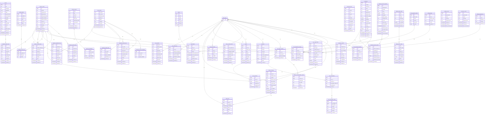

# Health Stack ERD (Auto-generated)

```mermaid
erDiagram
    auth_users {
        uuid id
    }
    user_profiles {
        uuid user_id
        text display_name
        text locale
        text timezone
        time wake_time
        time breakfast_time
        time lunch_time
        time dinner_time
        time bed_time
        timestamptz created_at
        timestamptz updated_at
    }
    user_preferences {
        bigint id
        uuid user_id
        text[] preferred_categories
        text[] excluded_ingredients
        jsonb health_conditions
        boolean notification_enabled
        timestamptz created_at
        timestamptz updated_at
    }
    foods_master {
        text rep_code
        text rep_name
        text modern_name
        text name_en
        text[] aliases
        text category
        jsonb nutrients
        timestamptz created_at
        timestamptz updated_at
    }
    disease_master {
        bigint id
        text disease
        text disease_read
        text disease_alias
        text disease_alias_read
        text modern_disease
        text modern_name_ko
        text name_en
        text icd10_code
        text category
        text[] aliases
        timestamptz created_at
        timestamptz updated_at
    }
    catalog_drugs {
        bigint id
        text name
        text generic_name
        text atc_code
        text source
        timestamptz updated_at
    }
    catalog_supplements {
        bigint id
        text name
        text ingredient
        text category
        timestamptz updated_at
    }
    user_intake_items {
        bigint id
        uuid user_id
        text item_type
        bigint catalog_drug_id
        bigint catalog_supplement_id
        text rep_code
        text display_name
        text dose_text
        text route
        boolean active
        timestamptz created_at
        timestamptz updated_at
    }
    intake_schedules {
        bigint id
        uuid user_id
        bigint intake_item_id
        text pattern
        int[] days_of_week
        text time_anchor
        time custom_time
        int offset_minutes
        jsonb rules
        boolean is_enabled
        timestamptz created_at
        timestamptz updated_at
    }
    intake_logs {
        bigint id
        uuid user_id
        bigint schedule_id
        timestamptz scheduled_at
        timestamptz taken_at
        text status
        text note
        timestamptz created_at
    }
    user_push_tokens {
        bigint id
        uuid user_id
        text platform
        text token
        boolean enabled
        timestamptz last_seen_at
        timestamptz created_at
    }
    reports {
        bigint id
        uuid user_id
        text report_type
        text title
        jsonb inputs
        text content_md
        text pdf_path
        text status
        timestamptz created_at
        timestamptz updated_at
    }
    symptom_ingredient_map {
        bigint id
        bigint symptom_id
        text rep_code
        text direction
        text rationale_ko
        text rationale_en
        int priority
        text source_ref
        text evidence_level
        timestamptz created_at
        timestamptz updated_at
    }
    recipes {
        bigint id
        text title
        text description
        jsonb ingredients
        jsonb steps
        int prep_time_min
        int cook_time_min
        int servings
        text difficulty
        text[] tags
        text[] meal_type
        text nature
        text[] flavor
        text[] target_organs
        text source_ref
        timestamptz created_at
        timestamptz updated_at
    }
    symptom_recipe_map {
        bigint id
        bigint symptom_id
        bigint recipe_id
        text meal_slot
        int priority
        text rationale_ko
        text best_time
        text frequency
        timestamptz created_at
        timestamptz updated_at
    }
    modern_to_mesh_map {
        bigint id
        bigint modern_disease_id
        text mesh_term
        text mesh_ui
        text mesh_tree
        text search_role
        int priority
        text note
        timestamptz created_at
        timestamptz updated_at
    }
    symptom_pubmed_map {
        bigint id
        bigint symptom_id
        text keyword_en
        text mesh_term
        text search_role
        int priority
        text note
        timestamptz created_at
        timestamptz updated_at
    }
    ingredient_pubmed_map {
        bigint id
        text rep_code
        text ingredient_name_en
        text mesh_term
        text bioactive_compound
        text compound_mesh
        text search_role
        int priority
        text note
        timestamptz created_at
        timestamptz updated_at
    }
    content_videos {
        bigint id
        text provider
        text video_id
        text title
        text channel
        text[] tags
        timestamptz created_at
    }
    symptom_video_map {
        bigint id
        bigint symptom_id
        bigint video_pk
        int priority
    }
    ingredient_product_links {
        bigint id
        text rep_code
        text provider
        text query_template
        text disclaimer_ko
        timestamptz created_at
    }
    interaction_facts {
        bigint id
        text a_type
        text a_ref
        text b_type
        text b_ref
        text severity
        text evidence_level
        text mechanism
        text summary_ko
        text action_ko
        jsonb sources
        text[] pmids
        timestamptz updated_at
    }
    pubmed_papers {
        text pmid
        text title
        text abstract
        text journal
        int pub_year
        text[] publication_types
        text[] mesh_terms
        text url
        timestamptz created_at
        timestamptz updated_at
    }
    pubmed_embeddings {
        text pmid
        int chunk_index
        text content
        vector embedding
        timestamptz created_at
    }
    plans {
        bigint id
        text code
        text name
        int price
        text currency
        jsonb features
        boolean is_active
    }
    subscriptions {
        bigint id
        uuid user_id
        text plan_code
        text status
        timestamptz current_period_start
        timestamptz current_period_end
        text provider
        text provider_sub_id
        timestamptz created_at
        timestamptz updated_at
    }
    payments {
        bigint id
        uuid user_id
        int amount
        text currency
        text provider
        text provider_payment_id
        text payment_type
        bigint reference_id
        text status
        timestamptz created_at
    }
    user_input_sessions {
        bigint id
        uuid user_id
        text input_type
        text input_summary
        timestamptz created_at
    }
    user_symptoms {
        bigint id
        uuid user_id
        bigint session_id
        bigint symptom_id
        text symptom_text
        timestamptz created_at
    }
    user_prescriptions {
        bigint id
        uuid user_id
        bigint session_id
        text prescription_image_url
        date prescribed_at
        timestamptz created_at
    }
    user_prescription_drugs {
        bigint id
        bigint prescription_id
        text drug_name
        text dosage
        text frequency
        text duration
        timestamptz created_at
    }
    session_recommendation_results {
        bigint id
        bigint session_id
        text result_type
        text ref_table
        text ref_id
        text reason
        timestamptz created_at
    }
    restaurants {
        bigint id
        text provider
        text external_id
        text name
        text category
        text address_full
        text address_road
        text address_region
        decimal latitude
        decimal longitude
        decimal rating_avg
        int review_count
        text phone
        text website_url
        boolean is_open
        json raw_json
        timestamptz last_synced_at
        timestamptz created_at
        timestamptz updated_at
    }
    restaurant_menus {
        bigint id
        bigint restaurant_id
        text menu_name
        text menu_category
        int price
        text currency
        text rep_codes
        text description
        boolean is_signature
        timestamptz created_at
        timestamptz updated_at
    }
    restaurant_search_templates {
        bigint id
        text rep_code
        text provider
        text query_template
    }
    restaurant_search_requests {
        bigint id
        text request_hash
        text provider
        text query
        decimal latitude
        decimal longitude
        int radius_meters
        text category_filter
        text sort_by
        int result_count
        int total_available
        timestamptz expires_at
        int cache_hit_count
        int api_quota_used
        timestamptz created_at
        timestamptz last_accessed_at
    }
    restaurant_search_results {
        bigint id
        bigint search_request_id
        bigint restaurant_id
        int rank_position
        int distance_meters
        decimal relevance_score
        text matched_keywords
        text matched_rep_codes
        timestamptz created_at
    }
    user_restaurant_favorites {
        bigint id
        uuid user_id
        bigint restaurant_id
        text note
        text tags
        timestamptz created_at
        timestamptz updated_at
    }
    user_restaurant_visit_logs {
        bigint id
        uuid user_id
        bigint restaurant_id
        text action_type
        bigint search_request_id
        bigint symptom_id
        timestamptz created_at
    }
    catalog_major_codes {
        text code
        text name
        text domain
        text description
        int sort_order
        boolean is_enabled
        timestamptz created_at
        timestamptz updated_at
    }
    catalog_minor_codes {
        text code
        text major_code
        text name
        text name_en
        text description
        int sort_order
        boolean is_enabled
        json meta
        timestamptz created_at
        timestamptz updated_at
    }
    youtube_cache {
        bigint id
        text query_hash
        text query
        text provider
        json response_json
        timestamptz expires_at
        timestamptz created_at
        timestamptz last_accessed_at
    }
    commerce_cache {
        bigint id
        text query_hash
        text query
        text provider
        json response_json
        timestamptz expires_at
        timestamptz created_at
        timestamptz last_accessed_at
    }
    tkm_symptom_master {
        bigint id
        text tkm_code
        text hanja
        text korean
        text name_en
        text[] aliases
    }
    tkm_to_modern_map {
        bigint id
        bigint tkm_symptom_id
        bigint modern_disease_id
        text mapping_strength
        text mapping_type
        text evidence_note
        text reviewer
        timestamptz reviewed_at
        timestamptz created_at
        timestamptz updated_at
    }
    auth_users ||--o{ user_profiles : has
    auth_users ||--o{ user_preferences : has
    auth_users ||--o{ user_intake_items : has
    catalog_drugs ||--o{ user_intake_items : has
    catalog_supplements ||--o{ user_intake_items : has
    foods_master ||--o{ user_intake_items : has
    auth_users ||--o{ intake_schedules : has
    user_intake_items ||--o{ intake_schedules : has
    auth_users ||--o{ intake_logs : has
    intake_schedules ||--o{ intake_logs : has
    auth_users ||--o{ user_push_tokens : has
    auth_users ||--o{ reports : has
    disease_master ||--o{ symptom_ingredient_map : has
    foods_master ||--o{ symptom_ingredient_map : has
    disease_master ||--o{ symptom_recipe_map : has
    recipes ||--o{ symptom_recipe_map : has
    disease_master ||--o{ modern_to_mesh_map : has
    disease_master ||--o{ symptom_pubmed_map : has
    foods_master ||--o{ ingredient_pubmed_map : has
    disease_master ||--o{ symptom_video_map : has
    content_videos ||--o{ symptom_video_map : has
    foods_master ||--o{ ingredient_product_links : has
    pubmed_papers ||--o{ pubmed_embeddings : has
    auth_users ||--o{ subscriptions : has
    plans ||--o{ subscriptions : has
    auth_users ||--o{ payments : has
    auth_users ||--o{ user_input_sessions : has
    auth_users ||--o{ user_symptoms : has
    user_input_sessions ||--o{ user_symptoms : has
    disease_master ||--o{ user_symptoms : has
    auth_users ||--o{ user_prescriptions : has
    user_input_sessions ||--o{ user_prescriptions : has
    user_prescriptions ||--o{ user_prescription_drugs : has
    user_input_sessions ||--o{ session_recommendation_results : has
    restaurants ||--o{ restaurant_menus : has
    foods_master ||--o{ restaurant_search_templates : has
    restaurant_search_requests ||--o{ restaurant_search_results : has
    restaurants ||--o{ restaurant_search_results : has
    auth_users ||--o{ user_restaurant_favorites : has
    restaurants ||--o{ user_restaurant_favorites : has
    auth_users ||--o{ user_restaurant_visit_logs : has
    restaurants ||--o{ user_restaurant_visit_logs : has
    restaurant_search_requests ||--o{ user_restaurant_visit_logs : has
    disease_master ||--o{ user_restaurant_visit_logs : has
    catalog_major_codes ||--o{ catalog_minor_codes : has
    tkm_symptom_master ||--o{ tkm_to_modern_map : has
    disease_master ||--o{ tkm_to_modern_map : has
    disease_master ||--o{ modern_to_mesh_map : has
    disease_master ||--o{ symptom_pubmed_map : has
    foods_master ||--o{ ingredient_pubmed_map : has
```
