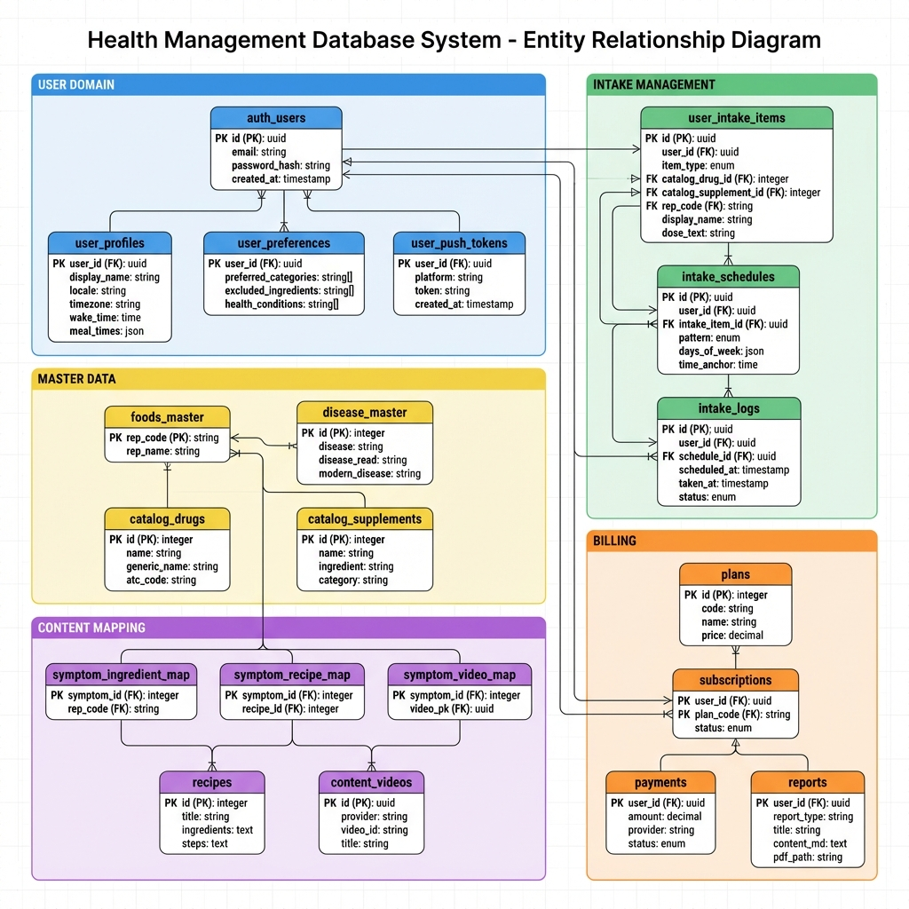

# ERD — Content · RAG · Billing (콘텐츠/식단 · 근거검색 · 결제)

> **범위**: 증상 기반 큐레이션(식재료/레시피/영상) + 커머스 링크 + 상호작용 지식베이스 + PubMed RAG + 결제/구독 + 캐시  
> **원칙**: 공용 데이터는 읽기 허용, 쓰기는 서버(service_role)에서 관리 권장  
> **소스**: [`schema.integrated.dbml`](./schema.integrated.dbml)  
> **최종 업데이트**: 2026-02-04

---

## 📊 ERD 이미지



---

## 🗂️ ERD 다이어그램 (Mermaid)

```mermaid
erDiagram
  %% ===== 마스터 데이터 =====
  DISEASE_MASTER {
    bigint id PK
    text disease
    text disease_read
    text disease_alias
    text disease_alias_read
    text modern_disease
    timestamptz created_at
  }

  FOODS_MASTER {
    text rep_code PK
    text rep_name
    timestamptz created_at
  }

  %% ===== 증상 → 콘텐츠 매핑 =====
  SYMPTOM_INGREDIENT_MAP {
    bigint id PK
    bigint symptom_id FK
    text rep_code FK
    text direction "good | caution | avoid"
    text rationale_ko
    int priority
    timestamptz created_at
  }

  RECIPES {
    bigint id PK
    text title
    text description
    jsonb ingredients
    jsonb steps
    text_array tags
    timestamptz created_at
    timestamptz updated_at
  }

  SYMPTOM_RECIPE_MAP {
    bigint id PK
    bigint symptom_id FK
    bigint recipe_id FK
    text meal_slot "breakfast | lunch | dinner | snack"
    int priority
  }

  CONTENT_VIDEOS {
    bigint id PK
    text provider "youtube"
    text video_id
    text title
    text channel
    text_array tags
    timestamptz created_at
  }

  SYMPTOM_VIDEO_MAP {
    bigint id PK
    bigint symptom_id FK
    bigint video_pk FK
    int priority
  }

  INGREDIENT_PRODUCT_LINKS {
    bigint id PK
    text rep_code FK
    text provider "iherb | naver_shopping | coupang"
    text query_template
    text disclaimer_ko
    timestamptz created_at
  }

  %% ===== 상호작용 / RAG =====
  INTERACTION_FACTS {
    bigint id PK
    text a_type "drug | supplement | food"
    text a_ref
    text b_type "drug | supplement | food"
    text b_ref
    text severity "none | mild | moderate | severe"
    text evidence_level "high | moderate | low | theoretical"
    text mechanism
    text summary_ko
    text action_ko
    jsonb sources
    text_array pmids
    timestamptz updated_at
  }

  PUBMED_PAPERS {
    text pmid PK
    text title
    text abstract
    text journal
    int pub_year
    text_array publication_types
    text_array mesh_terms
    text url
    timestamptz created_at
    timestamptz updated_at
  }

  PUBMED_EMBEDDINGS {
    text pmid PK_FK
    int chunk_index PK
    text content
    vector embedding "pgvector"
    timestamptz created_at
  }

  %% ===== 결제 / 구독 =====
  PLANS {
    bigint id PK
    text code
    text name
    int price
    text currency
    jsonb features
    boolean is_active
  }

  SUBSCRIPTIONS {
    bigint id PK
    uuid user_id FK
    text plan_code FK
    text status "active | canceled | past_due | trialing"
    timestamptz current_period_start
    timestamptz current_period_end
    text provider "stripe | iap_ios | iap_android"
    text provider_sub_id
    timestamptz created_at
    timestamptz updated_at
  }

  PAYMENTS {
    bigint id PK
    uuid user_id FK
    int amount
    text currency
    text provider
    text provider_payment_id
    text payment_type "subscription | one_time | report"
    bigint reference_id
    text status "pending | succeeded | failed | refunded"
    timestamptz created_at
  }

  %% ===== 캐시 테이블 =====
  YOUTUBE_CACHE {
    bigint id PK
    text query_hash UK
    text query
    text provider "youtube"
    json response_json
    timestamptz expires_at
    timestamptz created_at
    timestamptz last_accessed_at
  }

  COMMERCE_CACHE {
    bigint id PK
    text query_hash UK
    text query
    text provider "iherb | naver_shopping | coupang"
    json response_json
    timestamptz expires_at
    timestamptz created_at
    timestamptz last_accessed_at
  }

  %% ===== 관계 정의 =====
  DISEASE_MASTER ||--o{ SYMPTOM_INGREDIENT_MAP : "1:N"
  FOODS_MASTER ||--o{ SYMPTOM_INGREDIENT_MAP : "1:N"
  DISEASE_MASTER ||--o{ SYMPTOM_RECIPE_MAP : "1:N"
  RECIPES ||--o{ SYMPTOM_RECIPE_MAP : "1:N"
  DISEASE_MASTER ||--o{ SYMPTOM_VIDEO_MAP : "1:N"
  CONTENT_VIDEOS ||--o{ SYMPTOM_VIDEO_MAP : "1:N"
  FOODS_MASTER ||--o{ INGREDIENT_PRODUCT_LINKS : "1:N"

  PUBMED_PAPERS ||--o{ PUBMED_EMBEDDINGS : "1:N"
  PLANS ||--o{ SUBSCRIPTIONS : "1:N (by code)"
```

---

## 📋 테이블 상세

### 1️⃣ 마스터 데이터

| 테이블 | PK | 설명 |
|--------|-----|------|
| `disease_master` | bigint id | 질환/증상 마스터 (동의보감 포함) |
| `foods_master` | text rep_code | 식재료 대표코드 마스터 |

---

### 2️⃣ 증상 → 콘텐츠 매핑

| 테이블 | PK | 설명 |
|--------|-----|------|
| `symptom_ingredient_map` | bigint id | 증상 → 식재료 매핑 (권장/주의/회피) |
| `symptom_recipe_map` | bigint id | 증상 → 레시피 매핑 |
| `symptom_video_map` | bigint id | 증상 → 영상 매핑 |
| `recipes` | bigint id | 레시피 정보 (재료, 단계) |
| `content_videos` | bigint id | YouTube 영상 콘텐츠 |
| `ingredient_product_links` | bigint id | 식재료 → 구매 링크 |

---

### 3️⃣ 상호작용 / RAG

| 테이블 | PK | 설명 |
|--------|-----|------|
| `interaction_facts` | bigint id | 약물/건기식/식품 상호작용 정보 |
| `pubmed_papers` | text pmid | PubMed 논문 메타데이터 |
| `pubmed_embeddings` | (pmid, chunk_index) | 논문 임베딩 (pgvector 벡터 검색) |

---

### 4️⃣ 결제 / 구독

| 테이블 | PK | 설명 |
|--------|-----|------|
| `plans` | bigint id | 구독 플랜 정의 (Free/Premium) |
| `subscriptions` | bigint id | 사용자 구독 상태 |
| `payments` | bigint id | 결제 내역 |

---

### 5️⃣ 캐시 테이블

| 테이블 | PK | 설명 |
|--------|-----|------|
| `youtube_cache` | bigint id | YouTube API 응답 캐시 |
| `commerce_cache` | bigint id | 커머스 API 응답 캐시 |

---

## 🔗 핵심 관계

```
disease_master (증상)
    │
    ├──── (1:N) ──── symptom_ingredient_map ←──── (N:1) ──── foods_master
    │
    ├──── (1:N) ──── symptom_recipe_map ←──── (N:1) ──── recipes
    │
    └──── (1:N) ──── symptom_video_map ←──── (N:1) ──── content_videos


foods_master
    │
    └──── (1:N) ──── ingredient_product_links


pubmed_papers
    │
    └──── (1:N) ──── pubmed_embeddings (pgvector)


plans
    │
    └──── (1:N by code) ──── subscriptions
```

---

## 📝 주요 Enum 값

### `symptom_ingredient_map.direction`
- `good` - 권장 (도움이 됨)
- `caution` - 주의 (적당히)
- `avoid` - 회피 (피하는 것이 좋음)

### `symptom_recipe_map.meal_slot`
- `breakfast` - 아침
- `lunch` - 점심
- `dinner` - 저녁
- `snack` - 간식

### `interaction_facts.severity`
- `none` - 문제 없음
- `mild` - 경미
- `moderate` - 중등도
- `severe` - 심각

### `interaction_facts.evidence_level`
- `high` - 높은 근거
- `moderate` - 중간 근거
- `low` - 낮은 근거
- `theoretical` - 이론적

### `subscriptions.status`
- `active` - 활성
- `canceled` - 취소됨
- `past_due` - 연체
- `trialing` - 체험 중

### `payments.status`
- `pending` - 대기 중
- `succeeded` - 성공
- `failed` - 실패
- `refunded` - 환불됨

---

## 🔧 기술 참고사항

### pgvector 설정
```sql
-- 확장 활성화
CREATE EXTENSION IF NOT EXISTS vector;

-- 임베딩 인덱스 생성
CREATE INDEX ON pubmed_embeddings 
  USING ivfflat (embedding vector_cosine_ops)
  WITH (lists = 100);
```

### 캐시 만료 정책
- `youtube_cache`: 24시간
- `commerce_cache`: 6시간 (가격 변동 고려)
