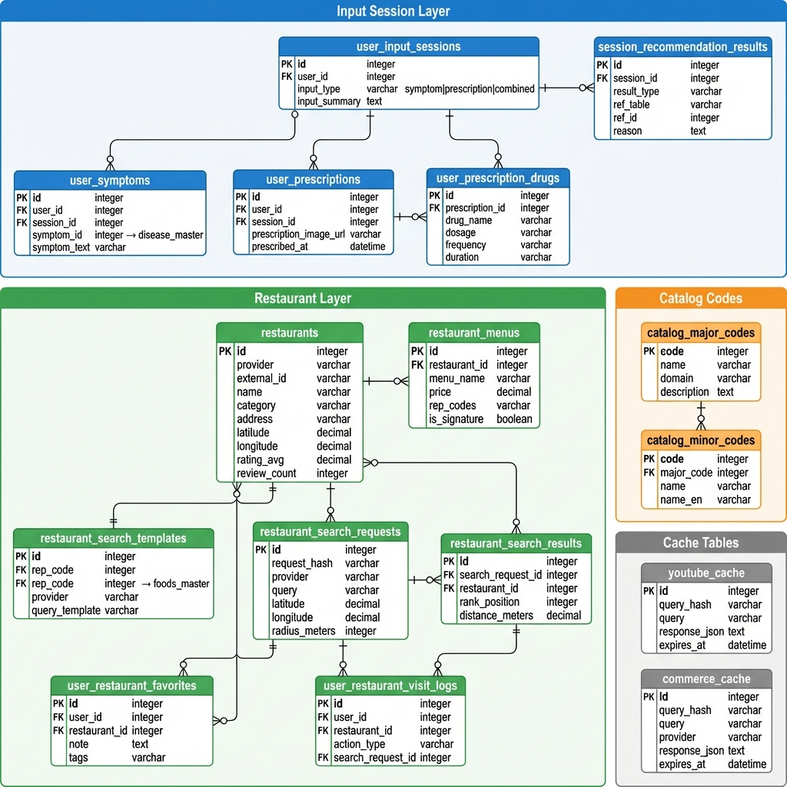

# ERD — Full (전체 통합)

> **범위**: Health Stack 전체 스키마 — 사용자/복용관리/콘텐츠/RAG/결제/입력세션/레스토랑  
> **용도**: 전체 구조 이해 (온보딩/아키텍처 리뷰)  
> **소스**: [`schema.integrated.dbml`](./schema.integrated.dbml)  
> **최종 업데이트**: 2026-02-04

---

## 📊 ERD 이미지

### 핵심 테이블 (Core)


### 확장 테이블 (Restaurant & Session)


---

## 🗂️ 전체 ERD 다이어그램 (Mermaid)

```mermaid
erDiagram
  %% ===== 인증 =====
  AUTH_USERS { uuid id PK }

  %% ===== 사용자 프로필 =====
  USER_PROFILES { uuid user_id PK_FK }
  USER_PREFERENCES { bigint id PK }
  USER_PUSH_TOKENS { bigint id PK }

  %% ===== 마스터 데이터 =====
  FOODS_MASTER { text rep_code PK }
  DISEASE_MASTER { bigint id PK }
  CATALOG_DRUGS { bigint id PK }
  CATALOG_SUPPLEMENTS { bigint id PK }

  %% ===== 복용 관리 =====
  USER_INTAKE_ITEMS { bigint id PK }
  INTAKE_SCHEDULES { bigint id PK }
  INTAKE_LOGS { bigint id PK }

  %% ===== 콘텐츠 / 매핑 =====
  SYMPTOM_INGREDIENT_MAP { bigint id PK }
  RECIPES { bigint id PK }
  SYMPTOM_RECIPE_MAP { bigint id PK }
  CONTENT_VIDEOS { bigint id PK }
  SYMPTOM_VIDEO_MAP { bigint id PK }
  INGREDIENT_PRODUCT_LINKS { bigint id PK }

  %% ===== 상호작용 / RAG =====
  INTERACTION_FACTS { bigint id PK }
  PUBMED_PAPERS { text pmid PK }
  PUBMED_EMBEDDINGS { text pmid FK_int chunk_index PK }

  %% ===== 결제 / 구독 =====
  PLANS { bigint id PK }
  SUBSCRIPTIONS { bigint id PK }
  PAYMENTS { bigint id PK }
  REPORTS { bigint id PK }

  %% ===== 입력 세션 레이어 =====
  USER_INPUT_SESSIONS { bigint id PK }
  USER_SYMPTOMS { bigint id PK }
  USER_PRESCRIPTIONS { bigint id PK }
  USER_PRESCRIPTION_DRUGS { bigint id PK }
  SESSION_RECOMMENDATION_RESULTS { bigint id PK }

  %% ===== 레스토랑 레이어 =====
  RESTAURANTS { bigint id PK }
  RESTAURANT_MENUS { bigint id PK }
  RESTAURANT_SEARCH_TEMPLATES { bigint id PK }
  RESTAURANT_SEARCH_REQUESTS { bigint id PK }
  RESTAURANT_SEARCH_RESULTS { bigint id PK }
  USER_RESTAURANT_FAVORITES { bigint id PK }
  USER_RESTAURANT_VISIT_LOGS { bigint id PK }

  %% ===== 카탈로그 코드 =====
  CATALOG_MAJOR_CODES { text code PK }
  CATALOG_MINOR_CODES { text code PK }

  %% ===== 캐시 테이블 =====
  YOUTUBE_CACHE { bigint id PK }
  COMMERCE_CACHE { bigint id PK }

  %% ===== 관계 정의 =====
  
  %% 사용자 관계
  AUTH_USERS ||--|| USER_PROFILES : "1:1"
  AUTH_USERS ||--o{ USER_PREFERENCES : "1:N"
  AUTH_USERS ||--o{ USER_PUSH_TOKENS : "1:N"
  AUTH_USERS ||--o{ REPORTS : "1:N"
  AUTH_USERS ||--o{ SUBSCRIPTIONS : "1:N"
  AUTH_USERS ||--o{ PAYMENTS : "1:N"
  
  %% 복용관리 관계
  AUTH_USERS ||--o{ USER_INTAKE_ITEMS : "1:N"
  USER_INTAKE_ITEMS ||--o{ INTAKE_SCHEDULES : "1:N"
  INTAKE_SCHEDULES ||--o{ INTAKE_LOGS : "1:N"
  CATALOG_DRUGS ||--o{ USER_INTAKE_ITEMS : "0:N"
  CATALOG_SUPPLEMENTS ||--o{ USER_INTAKE_ITEMS : "0:N"
  FOODS_MASTER ||--o{ USER_INTAKE_ITEMS : "0:N"
  
  %% 콘텐츠 매핑 관계
  DISEASE_MASTER ||--o{ SYMPTOM_INGREDIENT_MAP : "1:N"
  FOODS_MASTER ||--o{ SYMPTOM_INGREDIENT_MAP : "1:N"
  DISEASE_MASTER ||--o{ SYMPTOM_RECIPE_MAP : "1:N"
  RECIPES ||--o{ SYMPTOM_RECIPE_MAP : "1:N"
  DISEASE_MASTER ||--o{ SYMPTOM_VIDEO_MAP : "1:N"
  CONTENT_VIDEOS ||--o{ SYMPTOM_VIDEO_MAP : "1:N"
  FOODS_MASTER ||--o{ INGREDIENT_PRODUCT_LINKS : "1:N"
  
  %% RAG / 논문 관계
  PUBMED_PAPERS ||--o{ PUBMED_EMBEDDINGS : "1:N"
  
  %% 결제 관계
  PLANS ||--o{ SUBSCRIPTIONS : "1:N"
  
  %% 입력 세션 관계
  AUTH_USERS ||--o{ USER_INPUT_SESSIONS : "1:N"
  USER_INPUT_SESSIONS ||--o{ USER_SYMPTOMS : "1:N"
  USER_INPUT_SESSIONS ||--o{ USER_PRESCRIPTIONS : "1:N"
  USER_INPUT_SESSIONS ||--o{ SESSION_RECOMMENDATION_RESULTS : "1:N"
  USER_PRESCRIPTIONS ||--o{ USER_PRESCRIPTION_DRUGS : "1:N"
  DISEASE_MASTER ||--o{ USER_SYMPTOMS : "0:N"
  
  %% 레스토랑 관계
  RESTAURANTS ||--o{ RESTAURANT_MENUS : "1:N"
  RESTAURANTS ||--o{ RESTAURANT_SEARCH_RESULTS : "0:N"
  RESTAURANTS ||--o{ USER_RESTAURANT_FAVORITES : "0:N"
  RESTAURANTS ||--o{ USER_RESTAURANT_VISIT_LOGS : "0:N"
  RESTAURANT_SEARCH_REQUESTS ||--o{ RESTAURANT_SEARCH_RESULTS : "1:N"
  FOODS_MASTER ||--o{ RESTAURANT_SEARCH_TEMPLATES : "1:N"
  AUTH_USERS ||--o{ USER_RESTAURANT_FAVORITES : "1:N"
  AUTH_USERS ||--o{ USER_RESTAURANT_VISIT_LOGS : "1:N"
  
  %% 카탈로그 코드 관계
  CATALOG_MAJOR_CODES ||--o{ CATALOG_MINOR_CODES : "1:N"
```

---

## 📋 테이블 목록 (도메인별)

### 1️⃣ 사용자 인증 & 프로필 (4개)

| 테이블 | PK | 설명 |
|--------|-----|------|
| `auth_users` | uuid id | Supabase 인증 (FK 참조용) |
| `user_profiles` | uuid user_id | 사용자 프로필, 시간대, 식사시간 |
| `user_preferences` | bigint id | 선호/제외 설정, 건강상태 |
| `user_push_tokens` | bigint id | 푸시 알림 토큰 |

---

### 2️⃣ 마스터 데이터 (4개)

| 테이블 | PK | 설명 |
|--------|-----|------|
| `foods_master` | text rep_code | 식재료 대표코드 |
| `disease_master` | bigint id | 질환/증상 마스터 |
| `catalog_drugs` | bigint id | 의약품 카탈로그 |
| `catalog_supplements` | bigint id | 건강기능식품 카탈로그 |

---

### 3️⃣ 복용 관리 (3개)

| 테이블 | PK | 설명 |
|--------|-----|------|
| `user_intake_items` | bigint id | 사용자 복용 항목 |
| `intake_schedules` | bigint id | 복용 스케줄 |
| `intake_logs` | bigint id | 복용 기록 로그 |

---

### 4️⃣ 콘텐츠 매핑 (6개)

| 테이블 | PK | 설명 |
|--------|-----|------|
| `symptom_ingredient_map` | bigint id | 증상 → 재료 매핑 |
| `symptom_recipe_map` | bigint id | 증상 → 레시피 매핑 |
| `symptom_video_map` | bigint id | 증상 → 영상 매핑 |
| `recipes` | bigint id | 레시피 정보 |
| `content_videos` | bigint id | 영상 콘텐츠 |
| `ingredient_product_links` | bigint id | 재료 → 구매링크 |

---

### 5️⃣ 상호작용 & RAG (3개)

| 테이블 | PK | 설명 |
|--------|-----|------|
| `interaction_facts` | bigint id | 약물/식품 상호작용 |
| `pubmed_papers` | text pmid | PubMed 논문 메타 |
| `pubmed_embeddings` | (pmid, chunk_index) | 논문 임베딩 (pgvector) |

---

### 6️⃣ 결제 & 구독 (4개)

| 테이블 | PK | 설명 |
|--------|-----|------|
| `plans` | bigint id | 구독 플랜 정의 |
| `subscriptions` | bigint id | 사용자 구독 상태 |
| `payments` | bigint id | 결제 내역 |
| `reports` | bigint id | 리포트 생성 이력 |

---

### 7️⃣ 입력 세션 레이어 (5개)

| 테이블 | PK | 설명 |
|--------|-----|------|
| `user_input_sessions` | bigint id | 입력 세션 (증상/처방전/혼합) |
| `user_symptoms` | bigint id | 세션별 증상 입력 |
| `user_prescriptions` | bigint id | 세션별 처방전 업로드 |
| `user_prescription_drugs` | bigint id | 처방전 내 약물 목록 |
| `session_recommendation_results` | bigint id | 세션별 추천 결과 |

---

### 8️⃣ 레스토랑 추천 (7개)

| 테이블 | PK | 설명 |
|--------|-----|------|
| `restaurants` | bigint id | 음식점 정보 |
| `restaurant_menus` | bigint id | 음식점 메뉴 |
| `restaurant_search_templates` | bigint id | 재료별 검색 템플릿 |
| `restaurant_search_requests` | bigint id | 검색 요청 (캐시) |
| `restaurant_search_results` | bigint id | 검색 결과 |
| `user_restaurant_favorites` | bigint id | 사용자 즐겨찾기 |
| `user_restaurant_visit_logs` | bigint id | 방문/조회 로그 |

---

### 9️⃣ 카탈로그 코드 (2개)

| 테이블 | PK | 설명 |
|--------|-----|------|
| `catalog_major_codes` | text code | 대분류 코드 |
| `catalog_minor_codes` | text code | 소분류 코드 |

---

### 🔟 캐시 테이블 (2개)

| 테이블 | PK | 설명 |
|--------|-----|------|
| `youtube_cache` | bigint id | YouTube API 응답 캐시 |
| `commerce_cache` | bigint id | 커머스 API 응답 캐시 |

---

## 📈 테이블 통계

| 도메인 | 테이블 수 |
|--------|----------|
| 사용자 인증 & 프로필 | 4 |
| 마스터 데이터 | 4 |
| 복용 관리 | 3 |
| 콘텐츠 매핑 | 6 |
| 상호작용 & RAG | 3 |
| 결제 & 구독 | 4 |
| 입력 세션 레이어 | 5 |
| 레스토랑 추천 | 7 |
| 카탈로그 코드 | 2 |
| 캐시 테이블 | 2 |
| **총계** | **40** |

---

## 🔗 핵심 관계 요약도

```
                          ┌─────────────────┐
                          │   auth_users    │
                          │    (중심)       │
                          └────────┬────────┘
          ┌──────────┬─────────┬───┴────┬──────────┬──────────┐
          ▼          ▼         ▼        ▼          ▼          ▼
   user_profiles  user_prefs  intake   sessions  favorites  subscriptions
                              items              visit_logs  payments
                                │
                   ┌────────────┼────────────┐
                   ▼            ▼            ▼
            catalog_drugs  catalog_suppl  foods_master
                                              │
                   ┌──────────────────────────┼──────────────────────────┐
                   ▼                          ▼                          ▼
        symptom_ingredient_map    restaurant_search_templates    ingredient_product_links
                   │
                   ▼
            disease_master
                   │
        ┌──────────┼──────────┐
        ▼          ▼          ▼
   symptom_recipe symptom_video user_symptoms
        │              │
        ▼              ▼
     recipes    content_videos
```

---

## 📝 참고사항

- **PostgreSQL** 기반 Supabase 스키마
- `auth_users`는 Supabase Auth 테이블 (외래키 참조용)
- 배열 타입: PostgreSQL `text[]`, `int[]` 사용 권장
- `pubmed_embeddings.embedding`: pgvector 확장 필요
- 레스토랑: 외부 지도 API (Kakao/Naver/Google) 연동 설계
