# Health Stack 통합 ERD

> 자동 생성일: 2026-02-04  
> 소스: `schema.integrated.dbml`

## 📊 전체 ERD 다이어그램

```mermaid
erDiagram
    %% ===== 사용자 인증 및 프로필 =====
    auth_users {
        uuid id PK
    }
    
    user_profiles {
        uuid user_id PK, FK
        text display_name
        text locale
        text timezone
        time wake_time
        time breakfast_time
        time lunch_time
        time dinner_time
        time bed_time
        timestamptz created_at
        timestamptz updated_at
    }
    
    user_preferences {
        bigint id PK
        uuid user_id FK
        text[] preferred_categories
        text[] excluded_ingredients
        jsonb health_conditions
        boolean notification_enabled
        timestamptz created_at
        timestamptz updated_at
    }
    
    %% ===== 마스터 데이터 =====
    foods_master {
        text rep_code PK
        text rep_name
        timestamptz created_at
    }
    
    disease_master {
        bigint id PK
        text disease
        text disease_read
        text disease_alias
        text disease_alias_read
        text modern_disease
        timestamptz created_at
    }
    
    catalog_drugs {
        bigint id PK
        text name
        text generic_name
        text atc_code
        text source
        timestamptz updated_at
    }
    
    catalog_supplements {
        bigint id PK
        text name
        text ingredient
        text category
        timestamptz updated_at
    }
    
    %% ===== 복용 관리 =====
    user_intake_items {
        bigint id PK
        uuid user_id FK
        text item_type
        bigint catalog_drug_id FK
        bigint catalog_supplement_id FK
        text rep_code FK
        text display_name
        text dose_text
        text route
        boolean active
        timestamptz created_at
        timestamptz updated_at
    }
    
    intake_schedules {
        bigint id PK
        uuid user_id FK
        bigint intake_item_id FK
        text pattern
        int[] days_of_week
        text time_anchor
        time custom_time
        int offset_minutes
        jsonb rules
        boolean is_enabled
        timestamptz created_at
        timestamptz updated_at
    }
    
    intake_logs {
        bigint id PK
        uuid user_id FK
        bigint schedule_id FK
        timestamptz scheduled_at
        timestamptz taken_at
        text status
        text note
        timestamptz created_at
    }
    
    %% ===== 푸시 알림 =====
    user_push_tokens {
        bigint id PK
        uuid user_id FK
        text platform
        text token
        boolean enabled
        timestamptz last_seen_at
        timestamptz created_at
    }
    
    %% ===== 리포트 =====
    reports {
        bigint id PK
        uuid user_id FK
        text report_type
        text title
        jsonb inputs
        text content_md
        text pdf_path
        text status
        timestamptz created_at
        timestamptz updated_at
    }
    
    %% ===== 증상-재료/레시피/영상 매핑 =====
    symptom_ingredient_map {
        bigint id PK
        bigint symptom_id FK
        text rep_code FK
        text direction
        text rationale_ko
        int priority
        timestamptz created_at
    }
    
    recipes {
        bigint id PK
        text title
        text description
        jsonb ingredients
        jsonb steps
        text[] tags
        timestamptz created_at
        timestamptz updated_at
    }
    
    symptom_recipe_map {
        bigint id PK
        bigint symptom_id FK
        bigint recipe_id FK
        text meal_slot
        int priority
    }
    
    content_videos {
        bigint id PK
        text provider
        text video_id
        text title
        text channel
        text[] tags
        timestamptz created_at
    }
    
    symptom_video_map {
        bigint id PK
        bigint symptom_id FK
        bigint video_pk FK
        int priority
    }
    
    ingredient_product_links {
        bigint id PK
        text rep_code FK
        text provider
        text query_template
        text disclaimer_ko
        timestamptz created_at
    }
    
    %% ===== 상호작용 및 논문 =====
    interaction_facts {
        bigint id PK
        text a_type
        text a_ref
        text b_type
        text b_ref
        text severity
        text evidence_level
        text mechanism
        text summary_ko
        text action_ko
        jsonb sources
        text[] pmids
        timestamptz updated_at
    }
    
    pubmed_papers {
        text pmid PK
        text title
        text abstract
        text journal
        int pub_year
        text[] publication_types
        text[] mesh_terms
        text url
        timestamptz created_at
        timestamptz updated_at
    }
    
    pubmed_embeddings {
        text pmid PK, FK
        int chunk_index PK
        text content
        vector embedding
        timestamptz created_at
    }
    
    %% ===== 결제/구독 =====
    plans {
        bigint id PK
        text code
        text name
        int price
        text currency
        jsonb features
        boolean is_active
    }
    
    subscriptions {
        bigint id PK
        uuid user_id FK
        text plan_code FK
        text status
        timestamptz current_period_start
        timestamptz current_period_end
        text provider
        text provider_sub_id
        timestamptz created_at
        timestamptz updated_at
    }
    
    payments {
        bigint id PK
        uuid user_id FK
        int amount
        text currency
        text provider
        text provider_payment_id
        text payment_type
        bigint reference_id
        text status
        timestamptz created_at
    }
    
    %% ===== 입력 세션 레이어 =====
    user_input_sessions {
        bigint id PK
        uuid user_id FK
        text input_type
        text input_summary
        timestamptz created_at
    }
    
    user_symptoms {
        bigint id PK
        uuid user_id FK
        bigint session_id FK
        bigint symptom_id FK
        text symptom_text
        timestamptz created_at
    }
    
    user_prescriptions {
        bigint id PK
        uuid user_id FK
        bigint session_id FK
        text prescription_image_url
        date prescribed_at
        timestamptz created_at
    }
    
    user_prescription_drugs {
        bigint id PK
        bigint prescription_id FK
        text drug_name
        text dosage
        text frequency
        text duration
        timestamptz created_at
    }
    
    session_recommendation_results {
        bigint id PK
        bigint session_id FK
        text result_type
        text ref_table
        text ref_id
        text reason
        timestamptz created_at
    }
    
    %% ===== 레스토랑 레이어 =====
    restaurants {
        bigint id PK
        text provider
        text external_id
        text name
        text category
        text address_full
        text address_road
        text address_region
        decimal latitude
        decimal longitude
        decimal rating_avg
        int review_count
        text phone
        text website_url
        boolean is_open
        json raw_json
        timestamptz last_synced_at
        timestamptz created_at
        timestamptz updated_at
    }
    
    restaurant_menus {
        bigint id PK
        bigint restaurant_id FK
        text menu_name
        text menu_category
        int price
        text currency
        text rep_codes
        text description
        boolean is_signature
        timestamptz created_at
        timestamptz updated_at
    }
    
    restaurant_search_templates {
        bigint id PK
        text rep_code FK
        text provider
        text query_template
        text category_filter
        text disclaimer_ko
        int priority
        timestamptz created_at
        timestamptz updated_at
    }
    
    restaurant_search_requests {
        bigint id PK
        text request_hash
        text provider
        text query
        decimal latitude
        decimal longitude
        int radius_meters
        text category_filter
        text sort_by
        int result_count
        int total_available
        timestamptz expires_at
        int cache_hit_count
        int api_quota_used
        timestamptz created_at
        timestamptz last_accessed_at
    }
    
    restaurant_search_results {
        bigint id PK
        bigint search_request_id FK
        bigint restaurant_id FK
        int rank_position
        int distance_meters
        decimal relevance_score
        text matched_keywords
        text matched_rep_codes
        timestamptz created_at
    }
    
    user_restaurant_favorites {
        bigint id PK
        uuid user_id FK
        bigint restaurant_id FK
        text note
        text tags
        timestamptz created_at
        timestamptz updated_at
    }
    
    user_restaurant_visit_logs {
        bigint id PK
        uuid user_id FK
        bigint restaurant_id FK
        text action_type
        bigint search_request_id FK
        bigint symptom_id FK
        timestamptz created_at
    }
    
    %% ===== 카탈로그 코드 =====
    catalog_major_codes {
        text code PK
        text name
        text domain
        text description
        int sort_order
        boolean is_enabled
        timestamptz created_at
        timestamptz updated_at
    }
    
    catalog_minor_codes {
        text code PK
        text major_code FK
        text name
        text name_en
        text description
        int sort_order
        boolean is_enabled
        json meta
        timestamptz created_at
        timestamptz updated_at
    }
    
    %% ===== 캐시 테이블 =====
    youtube_cache {
        bigint id PK
        text query_hash
        text query
        text provider
        json response_json
        timestamptz expires_at
        timestamptz created_at
        timestamptz last_accessed_at
    }
    
    commerce_cache {
        bigint id PK
        text query_hash
        text query
        text provider
        json response_json
        timestamptz expires_at
        timestamptz created_at
        timestamptz last_accessed_at
    }

    %% ===== 관계 정의 =====
    auth_users ||--|| user_profiles : "has"
    auth_users ||--o{ user_preferences : "has"
    auth_users ||--o{ user_intake_items : "owns"
    auth_users ||--o{ intake_schedules : "has"
    auth_users ||--o{ intake_logs : "logs"
    auth_users ||--o{ user_push_tokens : "registers"
    auth_users ||--o{ reports : "generates"
    auth_users ||--o{ subscriptions : "subscribes"
    auth_users ||--o{ payments : "makes"
    auth_users ||--o{ user_input_sessions : "creates"
    auth_users ||--o{ user_symptoms : "reports"
    auth_users ||--o{ user_prescriptions : "uploads"
    auth_users ||--o{ user_restaurant_favorites : "favorites"
    auth_users ||--o{ user_restaurant_visit_logs : "visits"
    
    catalog_drugs ||--o{ user_intake_items : "references"
    catalog_supplements ||--o{ user_intake_items : "references"
    foods_master ||--o{ user_intake_items : "references"
    foods_master ||--o{ symptom_ingredient_map : "maps"
    foods_master ||--o{ ingredient_product_links : "links"
    foods_master ||--o{ restaurant_search_templates : "templates"
    
    disease_master ||--o{ symptom_ingredient_map : "maps"
    disease_master ||--o{ symptom_recipe_map : "maps"
    disease_master ||--o{ symptom_video_map : "maps"
    disease_master ||--o{ user_symptoms : "references"
    disease_master ||--o{ user_restaurant_visit_logs : "references"
    
    user_intake_items ||--o{ intake_schedules : "scheduled"
    intake_schedules ||--o{ intake_logs : "logged"
    
    recipes ||--o{ symptom_recipe_map : "maps"
    content_videos ||--o{ symptom_video_map : "maps"
    
    pubmed_papers ||--o{ pubmed_embeddings : "embeds"
    
    plans ||--o{ subscriptions : "subscribed"
    
    user_input_sessions ||--o{ user_symptoms : "contains"
    user_input_sessions ||--o{ user_prescriptions : "contains"
    user_input_sessions ||--o{ session_recommendation_results : "generates"
    
    user_prescriptions ||--o{ user_prescription_drugs : "contains"
    
    restaurants ||--o{ restaurant_menus : "has"
    restaurants ||--o{ restaurant_search_results : "found"
    restaurants ||--o{ user_restaurant_favorites : "favorited"
    restaurants ||--o{ user_restaurant_visit_logs : "visited"
    
    restaurant_search_requests ||--o{ restaurant_search_results : "contains"
    restaurant_search_requests ||--o{ user_restaurant_visit_logs : "triggers"
    
    catalog_major_codes ||--o{ catalog_minor_codes : "contains"
```



---

## 📋 테이블 도메인별 분류

### 1️⃣ 사용자 인증 & 프로필
| 테이블 | 설명 |
|--------|------|
| `auth_users` | Supabase 인증 사용자 (FK 참조용) |
| `user_profiles` | 사용자 프로필 (시간대, 식사시간 등) |
| `user_preferences` | 사용자 선호/제외 설정 |
| `user_push_tokens` | 푸시 알림 토큰 |

### 2️⃣ 마스터 데이터
| 테이블 | 설명 |
|--------|------|
| `foods_master` | 식재료 대표코드 마스터 |
| `disease_master` | 질환/증상 마스터 |
| `catalog_drugs` | 의약품 카탈로그 |
| `catalog_supplements` | 건강기능식품 카탈로그 |

### 3️⃣ 복용 관리
| 테이블 | 설명 |
|--------|------|
| `user_intake_items` | 사용자 복용 항목 (약/영양제/식품) |
| `intake_schedules` | 복용 스케줄 |
| `intake_logs` | 복용 기록 로그 |

### 4️⃣ 콘텐츠 매핑
| 테이블 | 설명 |
|--------|------|
| `symptom_ingredient_map` | 증상-재료 매핑 |
| `symptom_recipe_map` | 증상-레시피 매핑 |
| `symptom_video_map` | 증상-영상 매핑 |
| `recipes` | 레시피 정보 |
| `content_videos` | 영상 콘텐츠 |
| `ingredient_product_links` | 재료-구매링크 매핑 |

### 5️⃣ 상호작용 & 근거
| 테이블 | 설명 |
|--------|------|
| `interaction_facts` | 약물/식품 상호작용 정보 |
| `pubmed_papers` | PubMed 논문 메타 |
| `pubmed_embeddings` | 논문 임베딩 (RAG용) |

### 6️⃣ 결제 & 구독
| 테이블 | 설명 |
|--------|------|
| `plans` | 구독 플랜 정의 |
| `subscriptions` | 사용자 구독 상태 |
| `payments` | 결제 내역 |
| `reports` | 리포트 생성 이력 |

### 7️⃣ 입력 세션 레이어
| 테이블 | 설명 |
|--------|------|
| `user_input_sessions` | 사용자 입력 세션 |
| `user_symptoms` | 세션별 증상 입력 |
| `user_prescriptions` | 세션별 처방전 업로드 |
| `user_prescription_drugs` | 처방전 내 약물 목록 |
| `session_recommendation_results` | 세션별 추천 결과 |

### 8️⃣ 레스토랑 추천
| 테이블 | 설명 |
|--------|------|
| `restaurants` | 음식점 정보 (지도 API 연동) |
| `restaurant_menus` | 음식점 메뉴 |
| `restaurant_search_templates` | 재료별 검색 템플릿 |
| `restaurant_search_requests` | 검색 요청 캐시 |
| `restaurant_search_results` | 검색 결과 |
| `user_restaurant_favorites` | 사용자 즐겨찾기 |
| `user_restaurant_visit_logs` | 방문/조회 로그 |

### 9️⃣ 카탈로그 코드
| 테이블 | 설명 |
|--------|------|
| `catalog_major_codes` | 대분류 코드 |
| `catalog_minor_codes` | 소분류 코드 |

### 🔟 캐시 테이블
| 테이블 | 설명 |
|--------|------|
| `youtube_cache` | YouTube API 응답 캐시 |
| `commerce_cache` | 커머스 API 응답 캐시 |

---

## 🔗 주요 관계 요약

```
┌─────────────────────────────────────────────────────────────────┐
│                        auth_users (중심)                         │
└─────────────────────────────────────────────────────────────────┘
        │
        ├── user_profiles (1:1)
        ├── user_preferences (1:N)
        ├── user_intake_items (1:N) ──┬── catalog_drugs
        │       │                     ├── catalog_supplements
        │       │                     └── foods_master
        │       └── intake_schedules (1:N) ── intake_logs (1:N)
        │
        ├── user_input_sessions (1:N)
        │       ├── user_symptoms ── disease_master
        │       ├── user_prescriptions ── user_prescription_drugs
        │       └── session_recommendation_results
        │
        ├── user_restaurant_favorites ── restaurants
        ├── user_restaurant_visit_logs ─┬── restaurants
        │                               ├── restaurant_search_requests
        │                               └── disease_master
        │
        ├── subscriptions ── plans
        ├── payments
        └── reports


┌─────────────────────────────────────────────────────────────────┐
│                    foods_master (식재료 중심)                     │
└─────────────────────────────────────────────────────────────────┘
        │
        ├── symptom_ingredient_map ── disease_master
        ├── ingredient_product_links
        └── restaurant_search_templates


┌─────────────────────────────────────────────────────────────────┐
│                    disease_master (증상 중심)                     │
└─────────────────────────────────────────────────────────────────┘
        │
        ├── symptom_ingredient_map ── foods_master
        ├── symptom_recipe_map ── recipes
        └── symptom_video_map ── content_videos
```

---

## 📝 참고사항

- **PostgreSQL** 기반 Supabase 스키마
- `auth_users`는 Supabase Auth 테이블 (외래키 참조용)
- 배열 타입은 PostgreSQL의 `text[]`, `int[]` 사용 권장
- `pubmed_embeddings`의 `vector` 타입은 pgvector 확장 필요
- 음식점 관련 테이블은 외부 지도 API(Kakao/Naver/Google) 연동 설계
