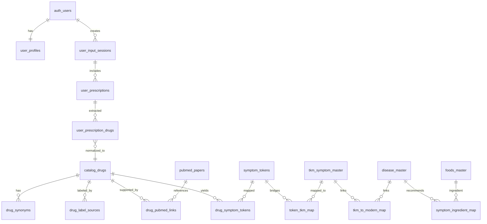

# ERD: Rx-Centric v2 (Mermaid)

```mermaid
erDiagram
  auth_users ||--|| user_profiles : has
  auth_users ||--o{ user_input_sessions : creates
  user_input_sessions ||--o{ user_prescriptions : includes
  user_prescriptions ||--o{ user_prescription_drugs : extracted

  catalog_drugs ||--o{ drug_synonyms : has
  catalog_drugs ||--o{ drug_label_sources : labeled_by
  catalog_drugs ||--o{ drug_pubmed_links : supported_by
  pubmed_papers ||--o{ drug_pubmed_links : references

  catalog_drugs ||--o{ drug_symptom_tokens : yields
  symptom_tokens ||--o{ drug_symptom_tokens : mapped

  symptom_tokens ||--o{ token_tkm_map : bridges
  tkm_symptom_master ||--o{ token_tkm_map : mapped_to

  tkm_symptom_master ||--o{ tkm_to_modern_map : links
  disease_master ||--o{ tkm_to_modern_map : links

  disease_master ||--o{ symptom_ingredient_map : recommends
  foods_master ||--o{ symptom_ingredient_map : ingredient

  user_prescription_drugs }o--|| catalog_drugs : normalized_to
```
