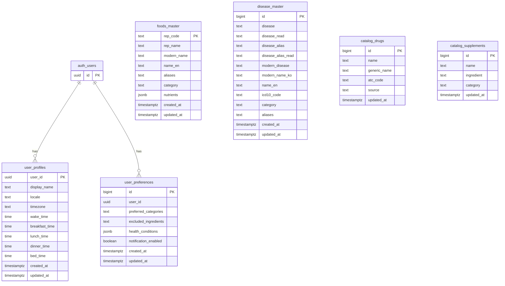

# Core User & Master Tables

**Tables**: auth_users, user_profiles, user_preferences, foods_master, disease_master, catalog_drugs, catalog_supplements

```mermaid
erDiagram
    auth_users {
        uuid id PK
    }
    user_profiles {
        uuid user_id PK
        text display_name
        text locale
        text timezone
        time wake_time
        time breakfast_time
        time lunch_time
        time dinner_time
        time bed_time
        timestamptz created_at
        timestamptz updated_at
    }
    user_preferences {
        bigint id PK
        uuid user_id
        text preferred_categories
        text excluded_ingredients
        jsonb health_conditions
        boolean notification_enabled
        timestamptz created_at
        timestamptz updated_at
    }
    foods_master {
        text rep_code PK
        text rep_name
        text modern_name
        text name_en
        text aliases
        text category
        jsonb nutrients
        timestamptz created_at
        timestamptz updated_at
    }
    disease_master {
        bigint id PK
        text disease
        text disease_read
        text disease_alias
        text disease_alias_read
        text modern_disease
        text modern_name_ko
        text name_en
        text icd10_code
        text category
        text aliases
        timestamptz created_at
        timestamptz updated_at
    }
    catalog_drugs {
        bigint id PK
        text name
        text generic_name
        text atc_code
        text source
        timestamptz updated_at
    }
    catalog_supplements {
        bigint id PK
        text name
        text ingredient
        text category
        timestamptz updated_at
    }
    auth_users ||--o{ user_profiles : has
    auth_users ||--o{ user_preferences : has
```
