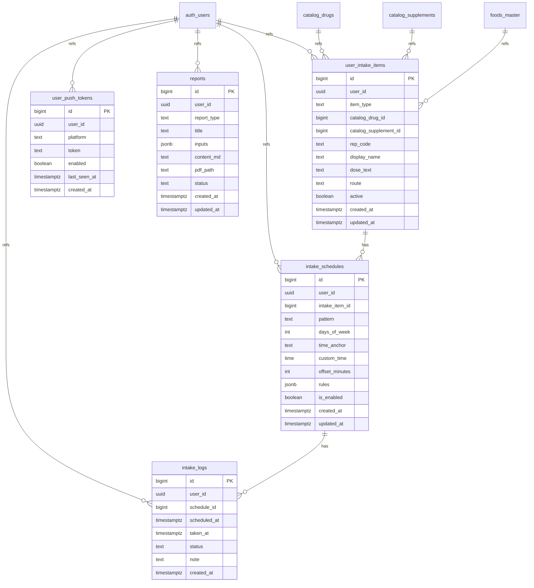

# Intake & Schedule Management

**Tables**: user_intake_items, intake_schedules, intake_logs, user_push_tokens, reports

```mermaid
erDiagram
    user_intake_items {
        bigint id PK
        uuid user_id
        text item_type
        bigint catalog_drug_id
        bigint catalog_supplement_id
        text rep_code
        text display_name
        text dose_text
        text route
        boolean active
        timestamptz created_at
        timestamptz updated_at
    }
    intake_schedules {
        bigint id PK
        uuid user_id
        bigint intake_item_id
        text pattern
        int days_of_week
        text time_anchor
        time custom_time
        int offset_minutes
        jsonb rules
        boolean is_enabled
        timestamptz created_at
        timestamptz updated_at
    }
    intake_logs {
        bigint id PK
        uuid user_id
        bigint schedule_id
        timestamptz scheduled_at
        timestamptz taken_at
        text status
        text note
        timestamptz created_at
    }
    user_push_tokens {
        bigint id PK
        uuid user_id
        text platform
        text token
        boolean enabled
        timestamptz last_seen_at
        timestamptz created_at
    }
    reports {
        bigint id PK
        uuid user_id
        text report_type
        text title
        jsonb inputs
        text content_md
        text pdf_path
        text status
        timestamptz created_at
        timestamptz updated_at
    }
    auth_users ||--o{ user_intake_items : refs
    catalog_drugs ||--o{ user_intake_items : refs
    catalog_supplements ||--o{ user_intake_items : refs
    foods_master ||--o{ user_intake_items : refs
    auth_users ||--o{ intake_schedules : refs
    user_intake_items ||--o{ intake_schedules : has
    auth_users ||--o{ intake_logs : refs
    intake_schedules ||--o{ intake_logs : has
    auth_users ||--o{ user_push_tokens : refs
    auth_users ||--o{ reports : refs
```
