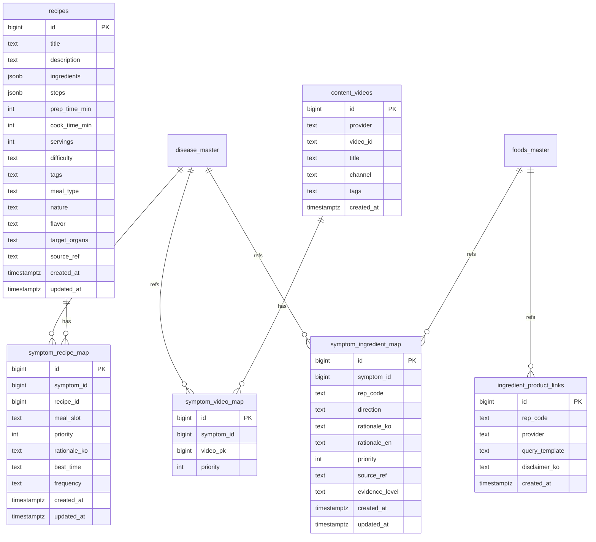

# Symptom & Ingredient Mapping

**Tables**: symptom_ingredient_map, recipes, symptom_recipe_map, content_videos, symptom_video_map, ingredient_product_links

```mermaid
erDiagram
    symptom_ingredient_map {
        bigint id PK
        bigint symptom_id
        text rep_code
        text direction
        text rationale_ko
        text rationale_en
        int priority
        text source_ref
        text evidence_level
        timestamptz created_at
        timestamptz updated_at
    }
    recipes {
        bigint id PK
        text title
        text description
        jsonb ingredients
        jsonb steps
        int prep_time_min
        int cook_time_min
        int servings
        text difficulty
        text tags
        text meal_type
        text nature
        text flavor
        text target_organs
        text source_ref
        timestamptz created_at
        timestamptz updated_at
    }
    symptom_recipe_map {
        bigint id PK
        bigint symptom_id
        bigint recipe_id
        text meal_slot
        int priority
        text rationale_ko
        text best_time
        text frequency
        timestamptz created_at
        timestamptz updated_at
    }
    content_videos {
        bigint id PK
        text provider
        text video_id
        text title
        text channel
        text tags
        timestamptz created_at
    }
    symptom_video_map {
        bigint id PK
        bigint symptom_id
        bigint video_pk
        int priority
    }
    ingredient_product_links {
        bigint id PK
        text rep_code
        text provider
        text query_template
        text disclaimer_ko
        timestamptz created_at
    }
    disease_master ||--o{ symptom_ingredient_map : refs
    foods_master ||--o{ symptom_ingredient_map : refs
    disease_master ||--o{ symptom_recipe_map : refs
    recipes ||--o{ symptom_recipe_map : has
    disease_master ||--o{ symptom_video_map : refs
    content_videos ||--o{ symptom_video_map : has
    foods_master ||--o{ ingredient_product_links : refs
```
