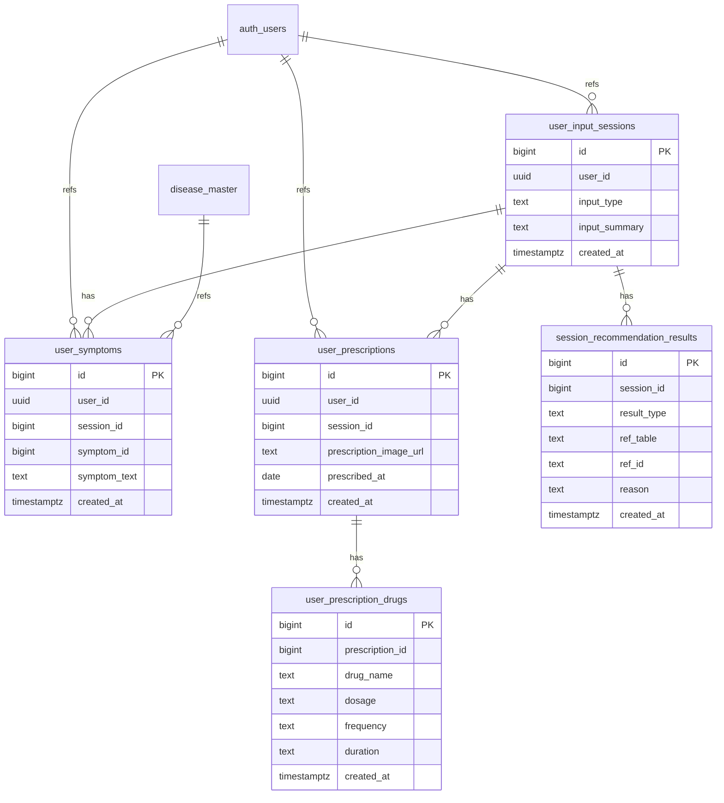

# User Input Sessions & Prescriptions

**Tables**: user_input_sessions, user_symptoms, user_prescriptions, user_prescription_drugs, session_recommendation_results

```mermaid
erDiagram
    user_input_sessions {
        bigint id PK
        uuid user_id
        text input_type
        text input_summary
        timestamptz created_at
    }
    user_symptoms {
        bigint id PK
        uuid user_id
        bigint session_id
        bigint symptom_id
        text symptom_text
        timestamptz created_at
    }
    user_prescriptions {
        bigint id PK
        uuid user_id
        bigint session_id
        text prescription_image_url
        date prescribed_at
        timestamptz created_at
    }
    user_prescription_drugs {
        bigint id PK
        bigint prescription_id
        text drug_name
        text dosage
        text frequency
        text duration
        timestamptz created_at
    }
    session_recommendation_results {
        bigint id PK
        bigint session_id
        text result_type
        text ref_table
        text ref_id
        text reason
        timestamptz created_at
    }
    auth_users ||--o{ user_input_sessions : refs
    auth_users ||--o{ user_symptoms : refs
    user_input_sessions ||--o{ user_symptoms : has
    disease_master ||--o{ user_symptoms : refs
    auth_users ||--o{ user_prescriptions : refs
    user_input_sessions ||--o{ user_prescriptions : has
    user_prescriptions ||--o{ user_prescription_drugs : has
    user_input_sessions ||--o{ session_recommendation_results : has
```
