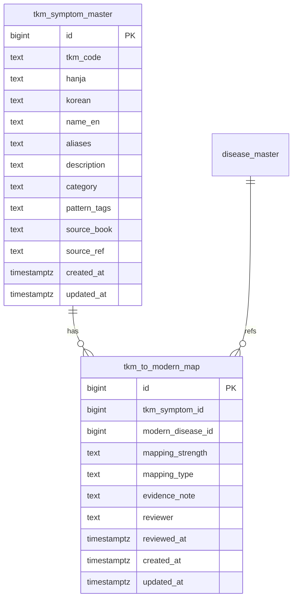

# TKM (동의보감) Symptom Mapping

**Tables**: tkm_symptom_master, tkm_to_modern_map

```mermaid
erDiagram
    tkm_symptom_master {
        bigint id PK
        text tkm_code
        text hanja
        text korean
        text name_en
        text aliases
        text description
        text category
        text pattern_tags
        text source_book
        text source_ref
        timestamptz created_at
        timestamptz updated_at
    }
    tkm_to_modern_map {
        bigint id PK
        bigint tkm_symptom_id
        bigint modern_disease_id
        text mapping_strength
        text mapping_type
        text evidence_note
        text reviewer
        timestamptz reviewed_at
        timestamptz created_at
        timestamptz updated_at
    }
    tkm_symptom_master ||--o{ tkm_to_modern_map : has
    disease_master ||--o{ tkm_to_modern_map : refs
```
